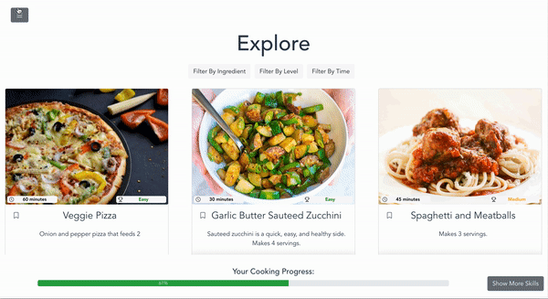

# Beginner's Kitchen
> Led a team of four (two developers, two designers) called Beginner's Kitchen to design, develop, and deploy a progressive web application tailored for novice cooks. Beginner's Kitchen allows users to browse, bookmark, and filter recipes by ingredient, difficulty level, and cooking time. Each recipe provides a short description, required ingredients, and cooking instructions. We conducted extensive user research on more than 20 potential users and implemented our prototype using JavaScript and Vue.js. We used our own JSON mock data to simulate the user's experience. You can view the images below to see how our app works or you can [try it out yourself](https://beginners-kitchen.herokuapp.com/). 
---
## To filter recipes: 
1. Filter by ingredient, difficulty level, or cooking duration
2. Click 'OK'
3. The recipes you're looking for should be there!
  ## 
---
## To bookmark recipes:
1. Make sure you are on the Explore page
2. Select the bookmark icon next to the recipe name
3. Go to the Bookmarks page. Your recipes should be there!
  ## 