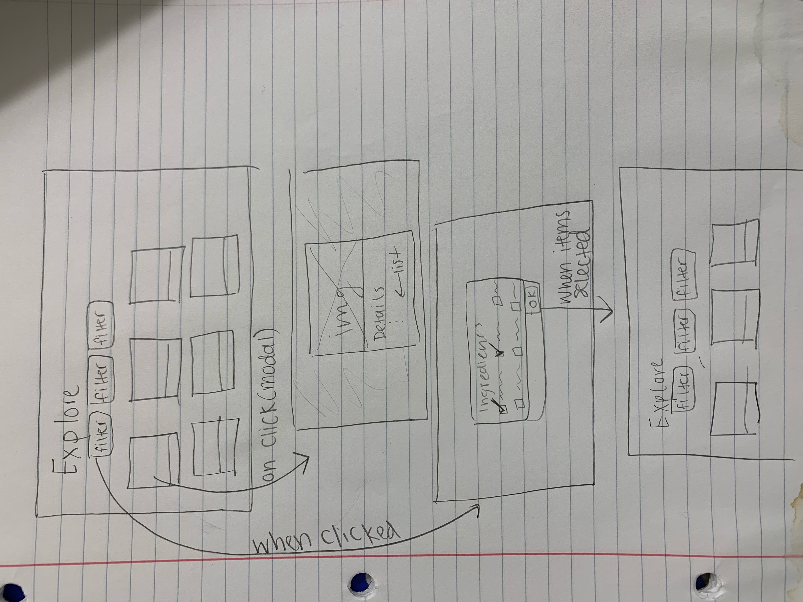
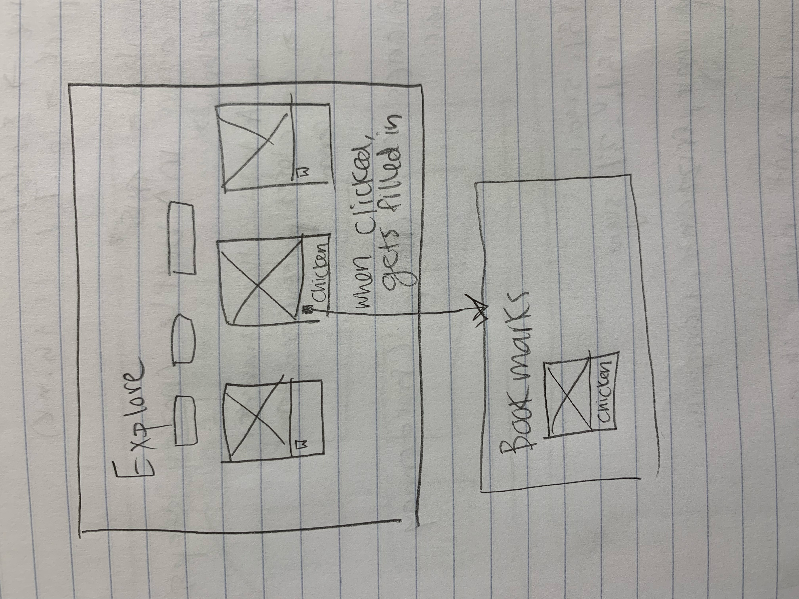
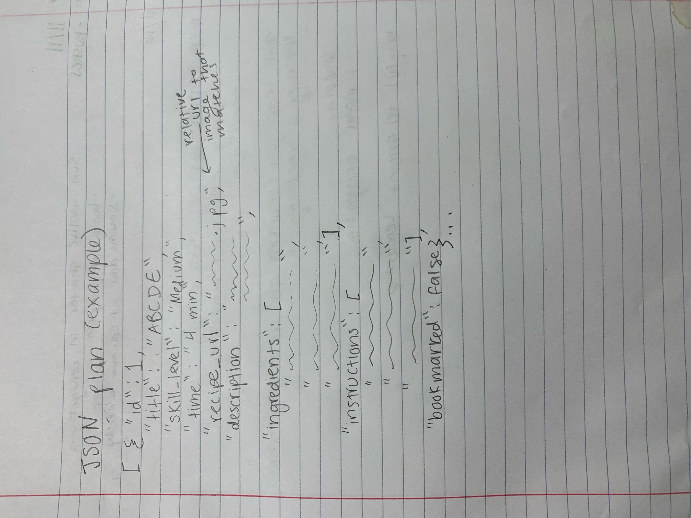

# Overview
- In this document, our team (Recipe Wars: Jordin, Rylee, Miranda, Tony, and Thomas), compiled our thoughts, JSON plan, and some interactivity flows for our Recipe Finder PWA, Beginner's Kitchen. 
- https://recipe-wars-project.herokuapp.com/
    - This is the link to our final PWA!

# Code Planning TOC
- [Overview](#overview)
- [Code Planning TOC](#code-planning-toc)
- [Revisions to Prior Work](#revisions-to-prior-work)
- [Planning and Visualizing Flows](#planning-and-visualizing-flows)
- [Planning JSON Data](#planning-json-data)
- [Timeline](#timeline)
- [Resources Consulted](#resources-consulted)

# Revisions to Prior Work
- **Scenarios**
    - We decided to alter some of our scenarios to better fit the needs of our users and after our design critiques with Professor Harms. We initially had a profile page where the user could store recipes from social media that they liked, but after assessing the purpose of a desktop of a PWA, we decided that a profile page was not necessary for our design. So, we decided to make a change; instead, users can view links to video tutorials in the recipe modals and bookmark recipes that they see on our platform and access those in a bookmarks page. Another scenario that we revisited was one where the user could input an ingredient and our app would generate suggestions for how to incorporate it. After revisiting our persona, we realized that our user was more concerned with growing their skills and working within time constraints, so we changed the scenario. Now, the scenario (#5) involves the user going to the calendar to check what prep they need to do for the next day (which relates growing skills with time management)
- **Designs**
    - After our design critique with Professor Harms we decided to make some alterations to our design. First, we decided to create a collapsable sidebar so that users can focus on each page individually and so that the recipe cards took up the majority of the screen space. Furthermore, we decided to do away with the onboarding process due to the large scope of our initial design. Because of this and after discussing what the goals of our persona were, we also decided to get rid of our profile page and redistribute some of its contents across other pages. The profile page initially stored the progress our user has made and the skills that they learned; now, there is a static progress bar on the Explore page where the user can access a modal to see more skills. Furthermore, the profile page is initially where the bookmarked recipes were stored. However, now we have a page dedicated to only the user's bookmarked recipes, so it is more apparent where to locate them.

# Planning and Visualizing Flows

- We used this sketch to visualize how we wanted our filter button and recipe modal interactions in JavaScript 
- Code plan:
    - When the user clicks on the title of the recipe title on the thumbnail, the modal appears, the dynamically loads the details information from the meals.json file
    - When the user clicks on any of the filter buttons, the modal appears
    - When the user selects one or more checkboxes inside the modal and clicks "OK", the recipes that appear on the explore page are filtered by the criteria they selected
      - Bootstrap allows us to store the selected options for each filter in an array. We can store the selected filters in these arrays and search for the selected property in all of our recipes. Whichever recipe contains this selected property will be returned on the screen.

- This sketch showed us how we want our bookmarking feature to work for our PWA
- Code plan:
    - When the user clicks on the bookmark icon, the icon gets filled in with a darker color
    - When the user bookmarks a recipe, change the bookmarked property in JSON to true
      - If the bookmarked property of the recipe is set to true, we add the recipe to our local storage and access this local storage in the bookmarks page. It will therefore appear on the Bookmarks page. 

# Planning JSON Data

- This is how we planned the structure of our JSON recipe data. We included multiple details for a recipe, an id number, and a relative url to an image for the recipe. Most properties were strings, but because there were multiple ingredients and instructions, those are arrays. 
- After re-evaluating the needs of our persona later on in the process, we also included a "video" property, which contains a link to a YouTube video (our person is a visual learner)

# Timeline
- **Original Timeline**
    - Work on homework 4 and understand JSON 11/10
    - Create branches and create an architecture plan, begin working on HTML, connect Bootstrap 11/11
    - Create recipe card component, format explore and calendar page 11/16
    - Collect and compile JSON data and begin implementing Javascript code, create progress bar 11/18
    - Make finishing touches and make sure app flows are working correctly 11/28
    - Deploy 11/30
- **Revised Timeline**
    - Work on homework 4 and understand JSON 11/10
    - Create branches and create an architecture plan, begin working on HTML, connect Bootstrap 11/11
    - Create recipe card component, format explore and calendar page 11/16
    - Collect and compile JSON data and begin implementing Javascript code, create progress bar 11/18
    - Connect JSON data to our pages and dynamically load the content 11/26
    - Create bookmarks page and implementing bookmark functionality 11/30
    - Make finishing touches and make sure app flows are working correctly 12/2
    - Deploy 12/5
    - Make revisions from post-presentation critiques 12/13

# Resources Consulted
- Below are resources we consulted to get our code working how we wanted: 
  - https://stackoverflow.com/questions/43925816/checkbox-filtering-with-vuejs
  - https://bootstrap-vue.org/docs/components/form-checkbox#checkbox-group-options-array
  - https://stackoverflow.com/questions/48455909/condition-in-v-bindstyle
  - https://stackoverflow.com/questions/54616139/how-to-animate-underline-from-left-to-right
  - https://bootstrap-vue.org/docs/components/form-tags#b-form-tag-helper-component
  - https://codepen.io/microbee/pen/QXMKVx
  - https://www.digitalocean.com/community/tutorials/build-a-to-do-app-with-vue-js-2
  - https://vuejs.org/v2/cookbook/client-side-storage.html
  - https://www.section.io/engineering-education/vue2-crud-app-with-localstorage/
  - https://thecodebarbarian.com/javascript-reduce-in-5-examples.html 
