# Overview
- In this document, our team (Recipe Wars: Jordin, Rylee, Miranda, Tony, and Thomas), compiled our brainstorming, initial and final sketches, and the rationale for our design for our Recipe Finder PWA. 

# Design Planning TOC
- [Overview](#overview)
- [Design Planning TOC](#design-planning-toc)
- [Revisions to Prior Work](#revisions-to-prior-work)
- [Brainstorming](#brainstorming)
- [Sketches](#sketches)
- [Final Design Sketches](#final-design-sketches)
- [Wireframe](#wireframe)
- [Rationale](#rationale)

# Revisions to Prior Work
- Brief overview added on 11/2 to describe the document.
- Description of initial interviewed users added on 11/2 (to the Overall Information Gathering Methods section) to clarify how these people were chosen.
- Value proposition regarding filtering by skill level added on 11/2 to emphasize the fact that we will be aiming to provide a solution to this key problem.
- Scenarios edited on 11/2 to be written in a more user-based and descriptive manner.
- Points added to persona on 11/2 to produce a more comprehensive picture of the user, and to imply our value propositions more clearly in his motivations.

# Brainstorming

  - For our brainstorming, we listed out the key problems and our persona (Alex) that we identified in Milestone 2 to make sure that the potential features that we came up with related to our user's problems and description. We also created symbols for each of our key problems and matched those symbols to the parts of the persona that matched them and to the potential features that would aim to solve these problems. 
    
-  We came up with a long list of features, each one relating to problems that our user faces. From there, we grouped the featured into categories that made sense and labeled them as follows:

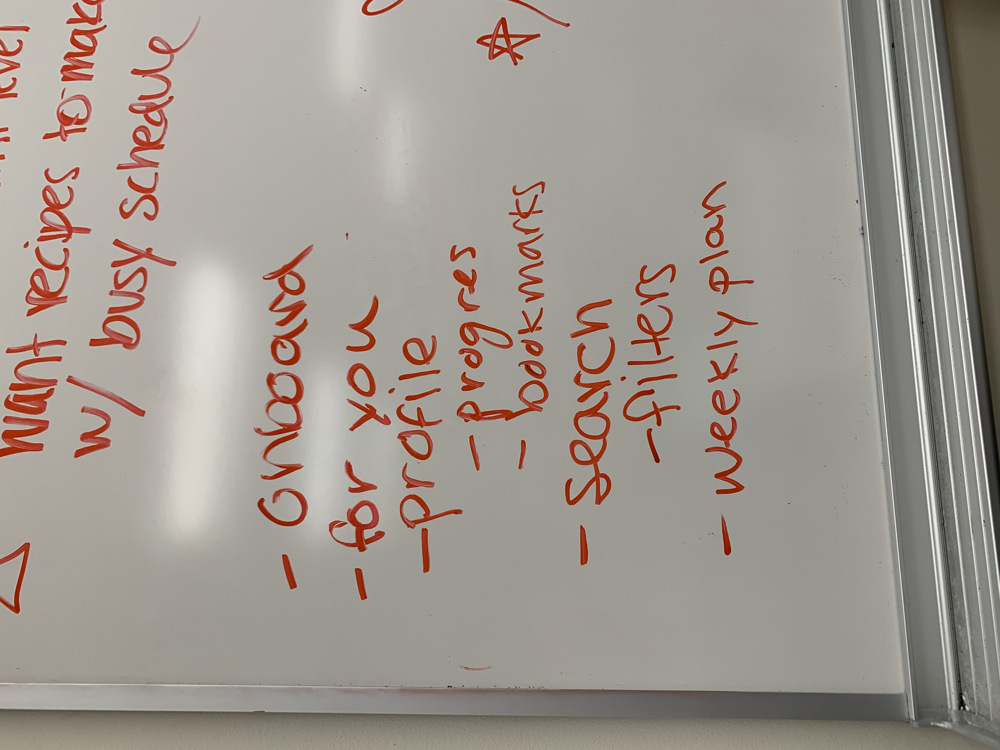
  

# Sketches

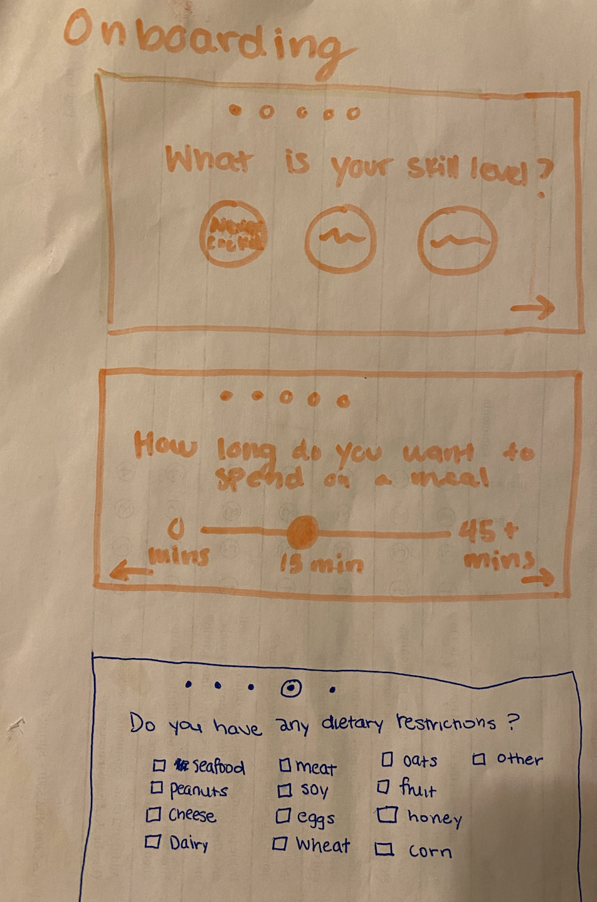

- In this sketch, we came up with questions to ask the user before they start using the recipe finding platform. The sketch asks about a range of issues such as skill level,  dietary restrictions, and time commitment they would like for cooking. While it was not used in our final design, it helped us think about what features to implement as a group and redirected our focus onto the core scenarios and theme of our project. 

  
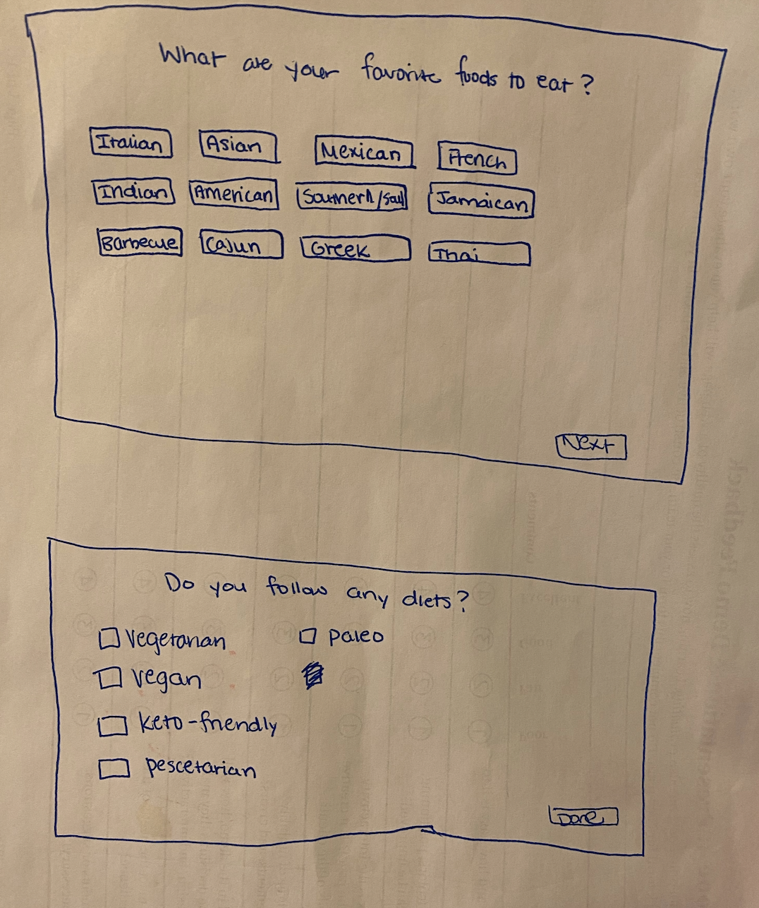

- Like the previous sketch, this sketch also asks about diets that the user may want to potentially follow (formally used to recommend recipes). Additionally, we asked about some favorite foods that the user may like to eat. Once the user has input all of this information, we were anticipating using this information within their "profile" and using AI or an algorithm to give them recipes that meet the criteria. Now that we are not having onboarding screen in our final design, we have redirected some of the ideas from it elsewhere in our project. 

  

- This sketch is the “Recommended For You” page and displays three different iterations of the design labeled 1, 2, and 3. The small differences in these designs are simply the layout. I decided on 3 as the final sketch since each recipe card can be quickly scanned by the user and they will get the information necessary such as the picture, title of the recipe, and the amount of time the recipe will take to prepare. The sketch also includes what a recipe card would look like when the user clicks on it. The essential information would be a picture of the recipe, the skill level of the recipe, time-to-cook, the recipe title, a short description, and the instructions. On Recipe card design #2, I included the ability to “like” a recipe and “complete” a recipe.

  

- In this sketch, the profile page shows the user's profile picture and brief biographical information (ex. cooking skill level). Underneath there are sections that are related to each person's individual progress. The skills section shows how much progress the user has made since they completed the onboarding process for our Recipe Finder and how close they are to completing tasks to become an 'expert' cook. Underneath that part is the bookmarked recipes section, where a user can access the recipes that they've saved to complete at a later date or recipes that they've made and really liked. 

  

- This sketch links to the Profile page by clicking 'See All' in the skills section. This page shows an expanded version of the skills that the user has learned by using our Recipe Finder. Each skill is listed out and there is a progress bar for each, showing how much the user has learned.

  
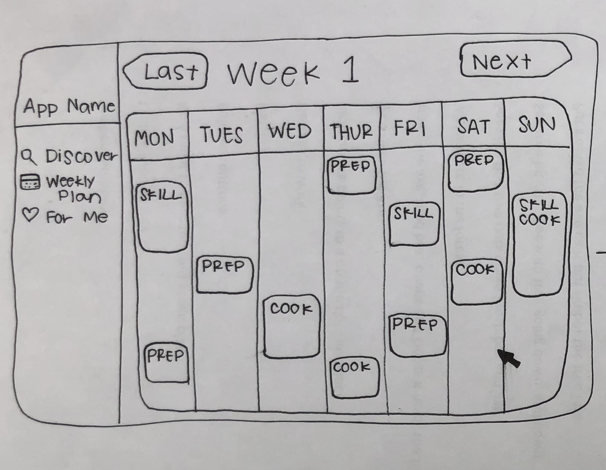

- This sketch shows the weekly plan page of the app. For each week, the app will provide a loose schedule of when users should try to learn new skills, complete prepwork, and cook meals (both meals for now and the near future). Users can click on each day's section of the weekly plan to receive more details, and can navigate between previous and future weeks.

  
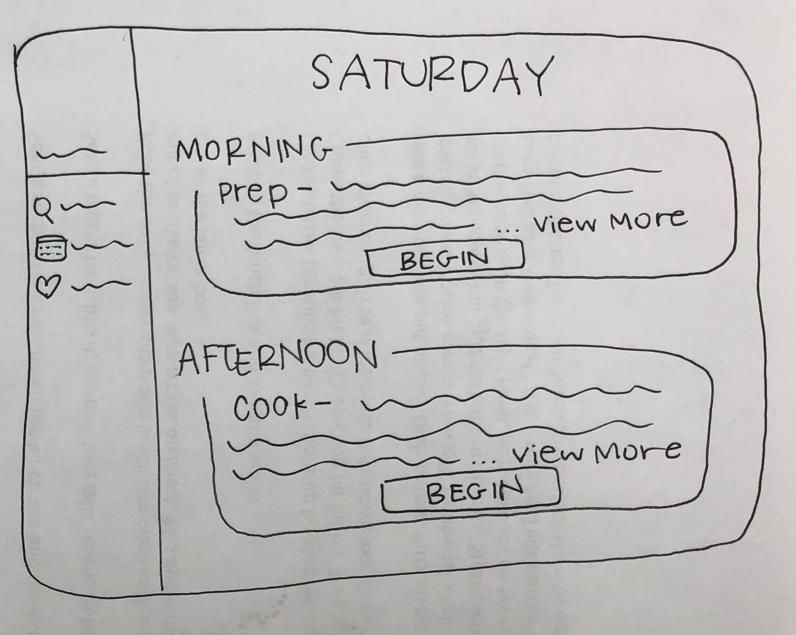

- In this sketch, a brief overview of the user's tasks for Saturday of Week 1 are displayed in a daily details page. The schedule only loosely defines when they should complete these tasks by indicating morning and afternoon, in order to allow them to fit it into their busy schedule whenever works best for them. This specific sketch shows example activities of prepwork and cooking a recipe, giving a brief summary of details for these tasks, and a button to begin the task. Once the user has completed these activities, the skills element of the profile page will indicate their progress.

  
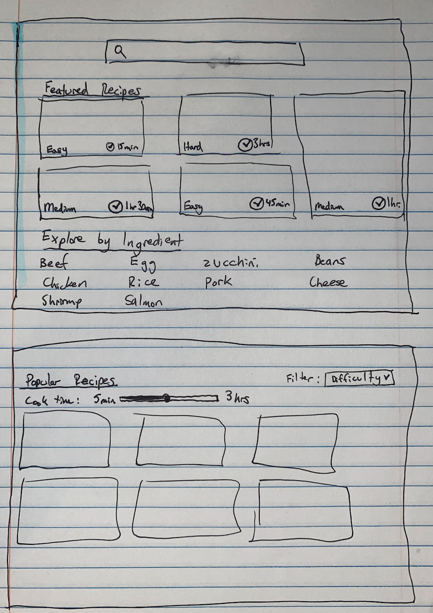

- In this sketch, the explore page provides a search bar, featured recipes, exploring by ingredients, and popular recipes. Also included on this page is a slider bar that can filter the cook time for popular recipes and also a filter that can allow the user to select a specific type of difficulty. These features try and address the key problem that users want more variety in meals, they want to see recipes that match their busy schedule, and also they want recipes that fit their skill level.

# Final Design Sketches

- This is the final sketch of the profile page. The navigation for the site was changed, and the way to access the profile page is no longer separate from the navigation. Also, the layout of the recipe boxes is changed to be consistent with other pages and to highlight the skill level and time required (2 of our key problems).

  
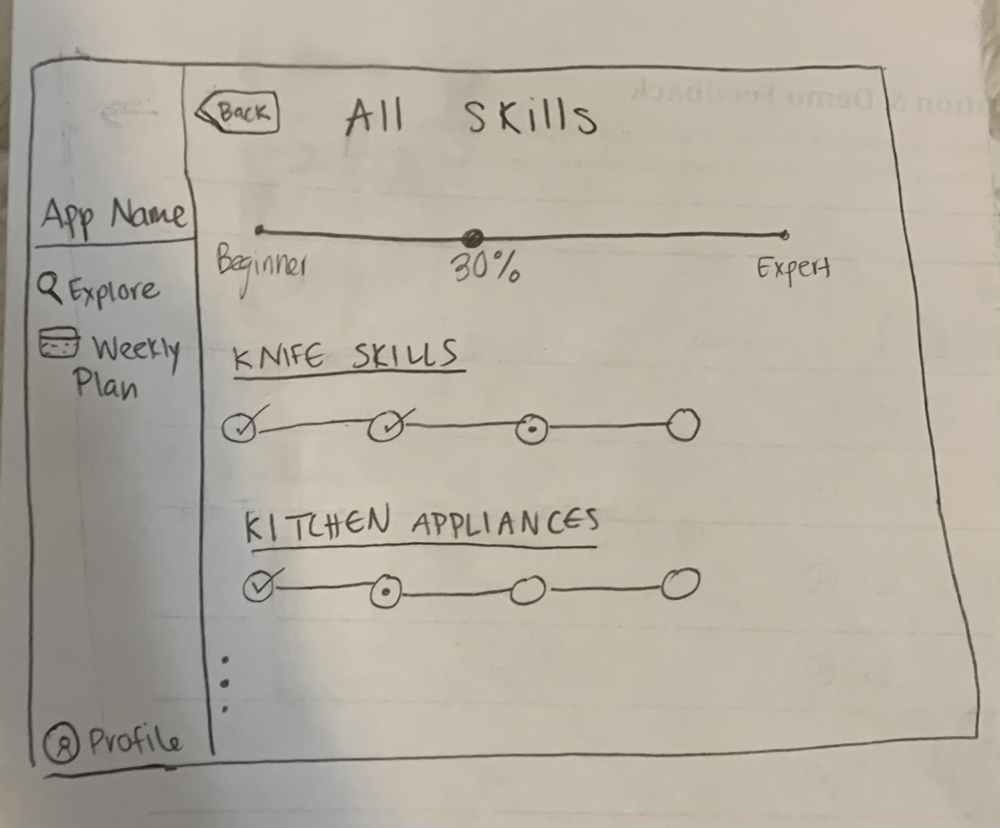

- This is the final sketch of the skills page. The new navigation was added and the back arrow changed to be consistent with other pages. 

  
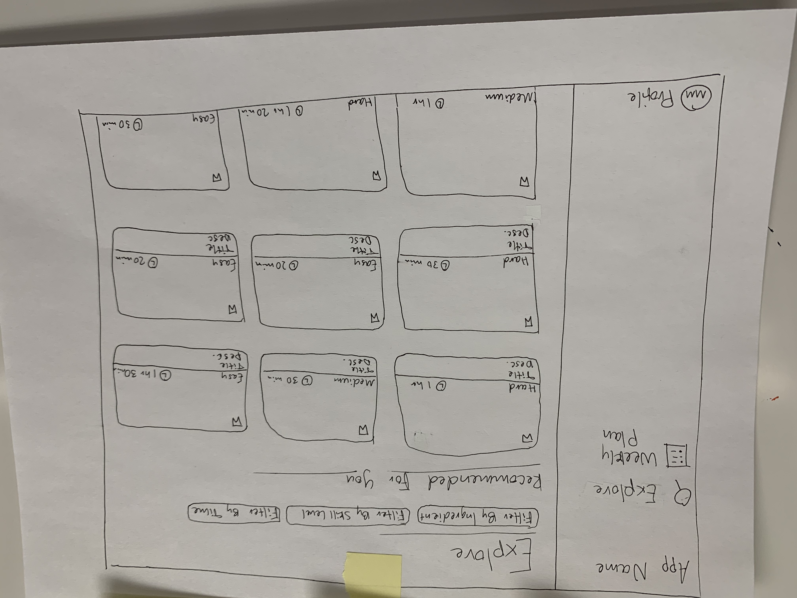

- In this version of the explore page, we combined the 'Discover' and 'For You' pages from the initial sketches. We also added ways for users to clearly filter by ingredient, time, and skill level.

  
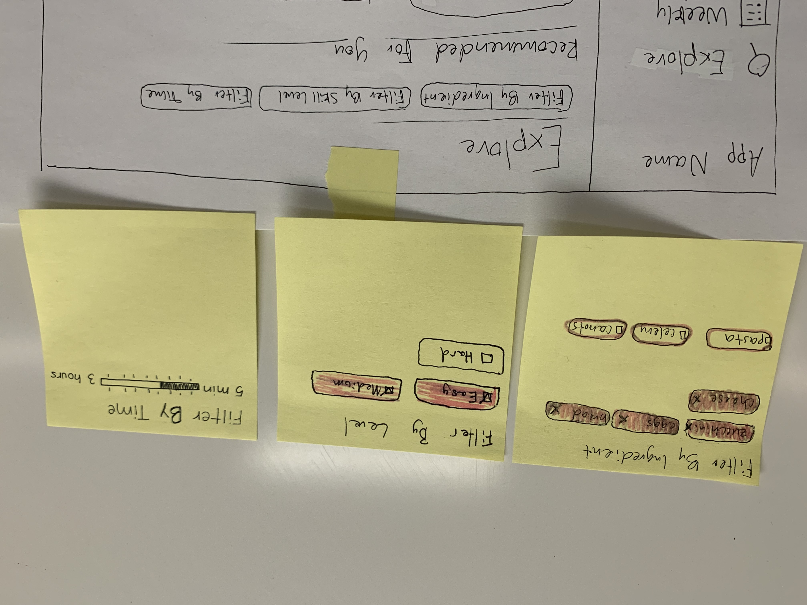

- This image shows what it looks like when the user selects the filter buttons and the different types of select options that appear for each filter.

  
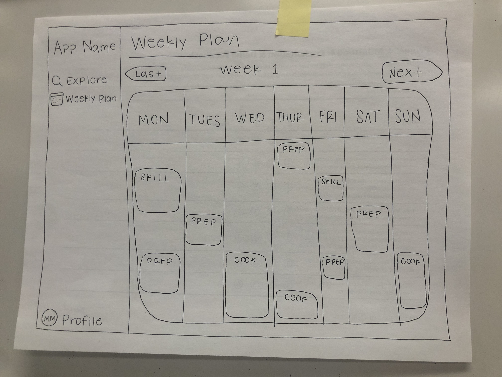

- This is the final sketch for the Weekly Plan page. The sketch illustrates the page's place in the navigation sidebar, as well as a sample plan for the user. Types of activities they could complete include skills (which will teach the user a new cooking skill while also prepping for a recipe), prepwork (which will help them to prepare for an upcoming meal with skills they have already learned), and cooking (in which the app will help them to complete a recipe with the prepared ingredients/food). The users are able to navigate to previous and upcoming weeks, and click on daily sections to gather more information.

  
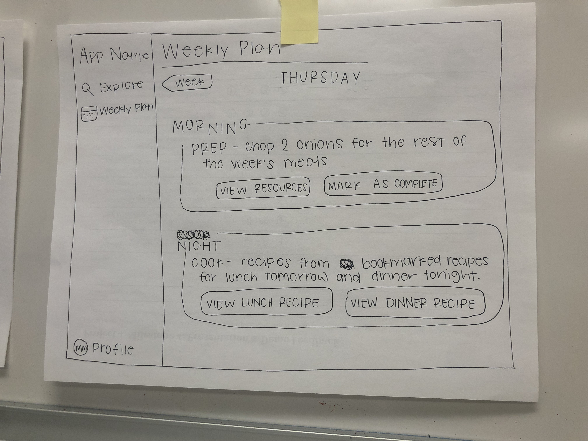

- In this final sketch of the Daily Details page, we provided a clarified example of details for Thursday of Week 1. The morning section describes an example prepwork activity for the user, as well as button controls to 'View Resources' (such as videos or written instructions to refresh their skills) and 'Mark as Complete' (to add to their skills). The night section describes the user's plan for the night, where the app instructs them to cook a recipe for dinner, as well as a lunch meal for the next day. These recipes come from/are inspired by recipes that the user has previously bookmarked, and they can visit the specifics of both recipes through their respective buttons below the description.

# Wireframe

- This image shows the wireframe of our PWA, indicating its proposed flow between pages. The Explore page will be the page that users first land on upon launch. They could then click the Filter controls at the top of the page to open filter dropdowns for Ingredient, Skill Level, and Time, respectively. From this page, they may also click on a recipe card, which will direct them to a recipe details page. From the Explore page or anywhere else on the app, users may also be directed to the Weekly Plan page through the navigation sidebar. From the Weekly Plan page, users may click on daily sections in order to open a daily details page. On this page, there may or may not be controls which will direct the user to recipe details page(s), depending on the week. From the navigation bar anywhere in the app, users can also move to the Profile page. The users may move from this page to a skills details page, by clicking the 'See More' control. Additionally, the profile page may direct users to a recipe details page through the 'Bookmarked Recipes' section.

# Rationale 
After a few iterations of sketches, we decided that to best fit our key problems (and the scope of this project) we would include a profile page (which includes bookmarked recipes and skills learned), a weekly plan page (showing users a timeline for skill building and prepping meals), and an explore page (featuring recipes based on skill level and allowing users to filter by certain criteria). 

Our final design took into account the key problems of users that we identified in the previous milestone (users want a variety of meals throughout the week, and users don't want to spend too much time on a meal and to cook efficiently with their given skill level). To address the issue of variety, the 'Recommended For You' section on the explore page allows users to see recipes that they wouldn't normally find (and don't have to search for extensively). Furthermore, our design helps solve the problem of users wanting to spend less time on meals and being able to cook with their given skill set by allowing users to filter all recipes by the time and the skill level they require.The weekly plan also helps the user to create time in their week for cooking and helps users with their goal to improve their cooking skills (which will allow them to increase the variety of meals that they are able to make).

Additionally, the bookmarked recipes feature allows us to create a more centralized platform for finding recipes, which is one of our focuses in our value proposition. Allowing for users to bookmark recipes to their profile creates a place where they can come back at any time and quickly locate a recipe that they are interested in. 

We decided to eliminate the onboarding feature (unless we have time to implement it) because the weekly plan and explore pages more effectively addressed our users' goals. 

Overall, We think the design communicates effectively with our user because it has a natural flow. The 3 main pages of the PWA are included in the navigation bar, which is visible on every page. The app starts out on the explore page, which is likely the main feature that users will use. From there, you can filter and access recipe details. The weekly plan is a separate page because it maps out what skills you are learning for the week and what days you need to prep/cook. The profile page contains all the information about a specific user (skills they've learned/need to learn and recipes that they want to make).
